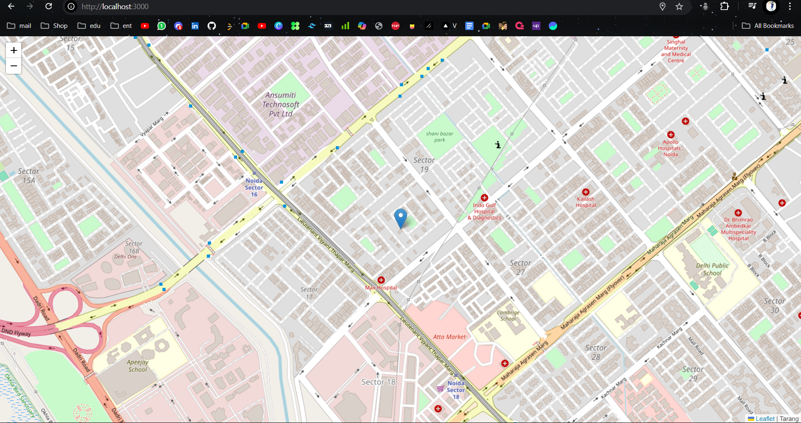

First the map is centered at 0,0 coords with a zoom of 16.

I have added OpenStreetMap tiles to the map.

Options are set to high accuracy, a 5-second timeout and no caching.

I used watchPosition to track the user's location. Then i emmited the latitude and longitude via a socket.

When receiving the location data via the socket, i extracted longitude, latitude and the id and created a marker and added it to the map.